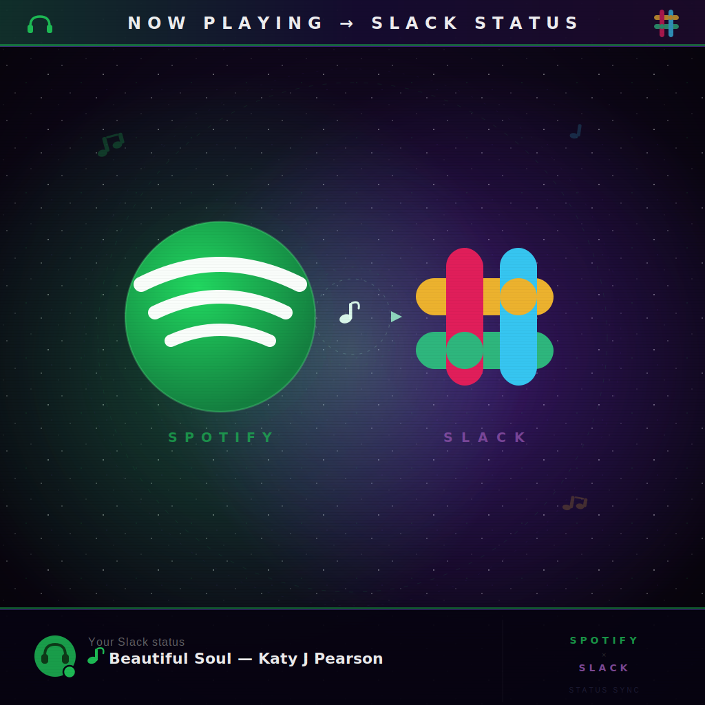

<p align="center">
  
</p>

# slack-spotify-status-sync

Updates your Slack status with the song currently playing on Spotify.

## How it works

Polls Spotify's `/me/player/currently-playing` endpoint and sets your Slack status to the track name and artist whenever the song changes. Uses smart polling — sleeps until the current track is about to end instead of hammering the API on a fixed interval.

When you pause or stop playback, the Slack status is cleared automatically. A Slack-side expiry is set as a safety net in case the process crashes.

## Setup

### 1. Create a Spotify app

1. Go to https://developer.spotify.com/dashboard → **Create App**
2. Set the redirect URI to `http://127.0.0.1:8888/callback`
3. Note the **Client ID** and **Client Secret**

### 2. Create a Slack app

1. Go to https://api.slack.com/apps → **Create New App → From scratch**
2. Under **OAuth & Permissions**, add `users.profile:write` to **User Token Scopes**
3. Click **Install to Workspace** and copy the `xoxp-` token

### 3. Configure

```bash
cp .env.example .env

# Edit .env with your Slack token and Spotify credentials
```

### 4. Authorize Spotify (one-time)

```bash
source .env && go run ./cmd/auth
```

Open the printed URL in your browser and authorize. This saves a `spotify_token.json` file that is automatically refreshed.

### 5. Run

```bash
source .env && go run .
```

Or build and run:

```bash
go build -o slack-spotify-status-sync .
source .env && ./slack-spotify-status-sync
```

## Configuration

| Environment Variable | Required | Default | Description |
| --- | --- | --- | --- |
| `SLACK_TOKEN` | Yes | — | Slack user OAuth token (`xoxp-...`) |
| `SPOTIFY_ID` | Yes | — | Spotify app Client ID |
| `SPOTIFY_SECRET` | Yes | — | Spotify app Client Secret |
| `SPOTIFY_TOKEN_JSON` | No* | — | Spotify OAuth token as JSON string (for Render — see below) |
| `SPOTIFY_REDIRECT_URI` | No | `http://127.0.0.1:8888/callback` | OAuth redirect URI (only used during local auth) |
| `PORT` | No | `8080` | Health server port (set automatically by Render) |

\* Either `SPOTIFY_TOKEN_JSON` or the `spotify_token.json` file must exist. The env var takes priority.

## Deploy to Render (free tier)

The app includes a built-in health server so it can run as a free Web Service on Render.

1. Push this repo to GitHub
2. Go to https://dashboard.render.com → **New → Web Service**
3. Connect your repo and configure:

| Field | Value |
| --- | --- |
| **Language** | Go |
| **Build Command** | `go build -tags netgo -ldflags '-s -w' -o app` |
| **Start Command** | `./app` |
| **Instance Type** | Free |

4. Add env vars under **Environment**:
   - `SLACK_TOKEN`, `SPOTIFY_ID`, `SPOTIFY_SECRET`
   - `SPOTIFY_TOKEN_JSON` — run `source .env && go run ./cmd/auth` locally, then copy the JSON string it prints into this env var
5. Set up a free ping bot to prevent Render from sleeping the service after 15 minutes of inactivity:
   - Sign up at https://uptimerobot.com (free)
   - Add a new HTTP(s) monitor pointing to `https://your-app.onrender.com/health`
   - Set interval to 5 minutes

## Infrastructure note

This needs to run on an always-on machine — if your device sleeps, the process suspends and you'll miss track changes. Render's free tier with a ping bot (see above) is the easiest option.
